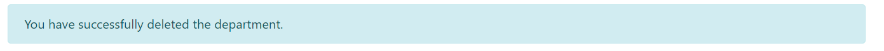

# Department app
Department app is a web application which uses
RESTful web service to record the information about departments
and their employees

Application should provide:
- Storing departments and employees in a database
- Display the list of departments and the average salary (calculated automatically) for these departments
- Update the list of departments (add, edit, delete a department)
- Display the list of employees
- Update the list of employees (add, edit, delete an employee)
- Search employees born on a certain date
- Search employees born on a certain date range

## 1. Homepage
The homepage of the app contains a brief description 
of the app and a button to start the work

*Main scenario:*

- User opens a site
- The homepage is displayed

Pic. 1.1 The homepage

*To start work scenario:*
- User presses the start work button and redirects to departments page
- User selects departments or employees options of the menu

## 2. Departments
### 2.1 Display the list of departments

*Main scenario:*

- User presses the start work button on the homepage
or selects the department option of the menu
- Application displays the list of departments

Pic 2.1.1 The departments page

The list displays following columns:
- Name, the unique name of department
- Description, the description of the department
- Employee count, the number of employees in each of departments
- Average salary, the average salary of the department, calculated
automatically by summing all the salaries of employees of the department
and dividing the sum by employee count

*When no departments have been added scenario:*
- User presses the start work button on the homepage
or selects the department option of the menu
- Application displays the text which states that no departments
have been found

Pic 2.1.2 The departments page when no departments were added

### 2.2 Add department
*Main scenario:*

- User clicks the "Add department" button on departments page
- Application displays a form to enter department data
- User enters department data and presses "Submit" button
- The record is added to database
- If an error occurs, the error message is displayed
- If new department record is successfully added, then list of departments
 with added record and a alert message is displayed
 
 *Cancel operation scenario:*
 - User clicks the "Add department" button on departments page
- Application displays a form to enter department data
- User enters department data and selects the menu option "Home",
"Departments" or "Employees"
- The data is not saved to the database and the corresponding page 
is displayed

Pic. 2.2. Add department

When adding a department, the following details are entered:

- The name of the department
- The description of the department

### 2.3 Edit department
*Main scenario:*
- User clicks the "Edit" button on departments page
- Application displays a form to enter department data, the 
current department data is predefined in the form
- User enters department data and presses "Submit" button
- The record is added to database
- If an error occurs, the error message is displayed
- If new department record is successfully edited, then list of departments
 with added record and a alert message is displayed
 
 *Cancel operation scenario:*
- User clicks the "Edit" button on departments page
- Application displays a form to enter department data, the 
current department data is predefined in the form
- User enters department data and selects the menu option "Home",
"Departments" or "Employees"
- The data is not saved to the database and the corresponding page 
is displayed

Pic. 2.3. Edit department

When editing a department, the following details are entered:

- The name of the department
- The description of the department

### 2.4 Delete a department

*Main scenario:*
- User clicks the "Delete" button on departments page
- The record is deleted from the database
- The updated list of departments and a alert message
is displayed

Pic. 2.4. Delete department alert

 